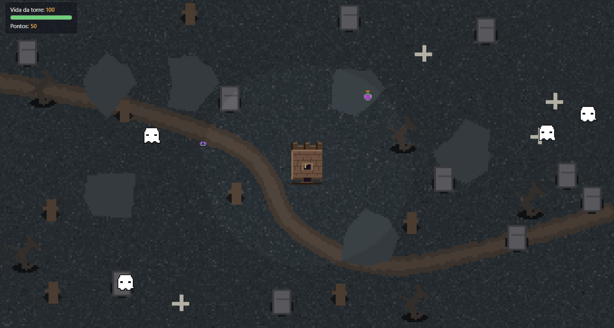
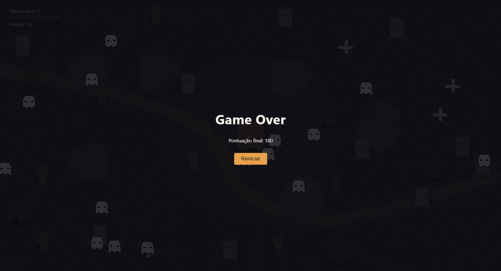

# Defesa de Torres

## O Jogo

Defesa de Torres é um jogo de _tower defense_ feito com WebGL 2. Uma torre medieval no centro do mapa é atacada por fantasmas que surgem das bordas da tela. A torre atira caveiras nos inimigos automaticamente, e o jogador pode clicar nos fantasmas para os matar e coletar poções de cura que eles podem deixar cair ao morrer. O jogo fica progressivamente mais difícil com o tempo.

## Criadoras

| Nome | Contato |
|------|---------|
| Ana Luiza Reis e Silva | [LinkedIn](https://www.linkedin.com/in/ana-luiza-reis-7307812a4/) |
| Bianca Marçal Pacífico | [LinkedIn](https://www.linkedin.com/in/biancapacifico/) |

## Media kit

## Opcionais implementados

- **Texturas animadas**: você pode criar animações de personagens ou cenário. Por exemplo, para inimigo andando, atacando... uma explosão, para os projéteis etc
  - Os inimigos (fantasmas) possuem animação de sprite com 4 frames.

- **Sons**: Colocar efeitos sonoros e música de fundo no seu jogo
  - O jogo possui música de fundo em loop que inicia ao primeiro clique.

- _**Power-ups**_: implemente alguns meios do jogador aumentar suas chances de sobrevivência. Por exemplo, pode haver uma chance para quando um inimigo for derrotado, ele "drop" ("deixe cair") um _power-up_ que pode ser coletado com o _mouse_.
  - Ao morrer, inimigos têm 30% de chance de dropar uma poção de cura. O jogador pode clicar na poção para recuperar 20 pontos de vida da torre.

- **Implementação criativa**: Dificuldade progressiva — a frequência de spawn dos inimigos aumenta gradualmente ao longo do tempo, começando em 1 inimigo a cada 2,5 segundos e chegando a 1 a cada 0,6 segundos após 45 segundos de jogo.

## Créditos

| Recurso | Autor | Link |
|---------|-------|------|
| Música de fundo — "Insistent Background Loop" | OpenGameArt | [opengameart.org](https://opengameart.org/content/insistent-background-loop) |
| Sprites e texturas (torre, fantasma, caveira, poção, background) | Criadas pelas autoras com Pillow (Python) | — |